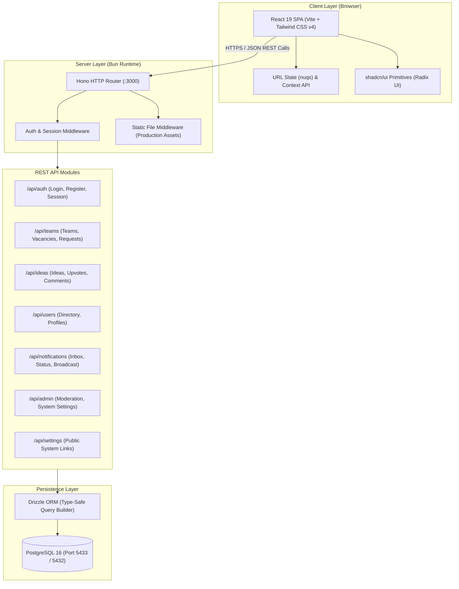
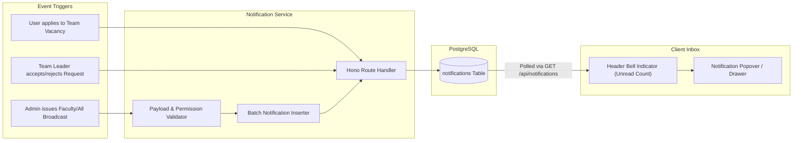
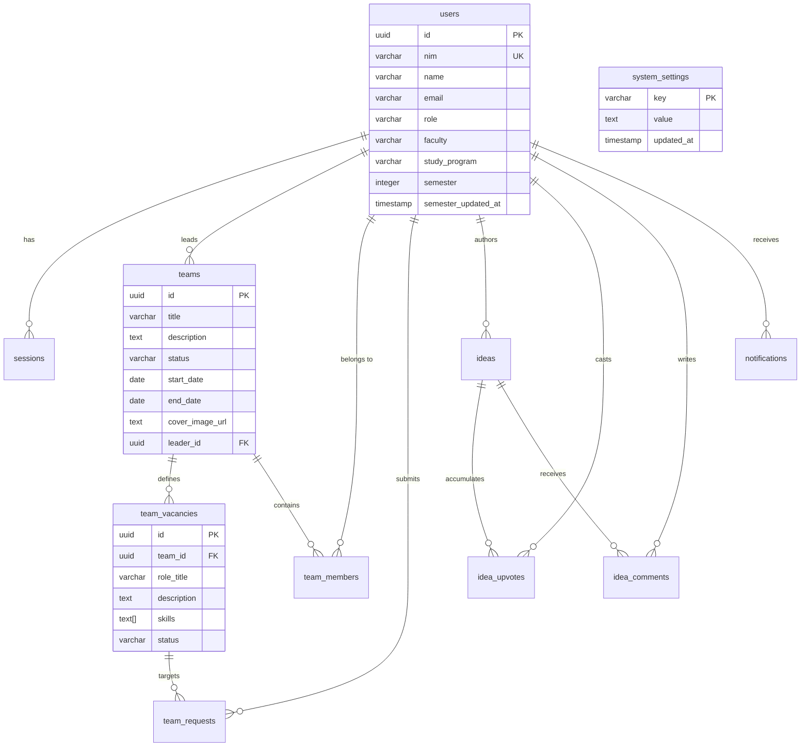

# UMBC System Architecture & Technical Specification

This document provides a comprehensive technical overview of **Universitas Mercu Buana Connect (UMBC)**, detailing its architectural topology, data flow, component interactions, database schema, and core design principles emphasizing a lean, zero-bloat approach.

---

## 1. System Overview

UMBC is architectured as a lightweight, cohesive full-stack web application designed for fast startup, low memory footprint, and low operational complexity.

The application utilizes **Bun** as both runtime and package manager, running **Hono** to serve REST endpoints and compile-free static client bundles. The client is a single-page application built with **React 19**, **Vite**, **Tailwind CSS v4**, and **shadcn/ui** (Radix UI primitives). Data persistence is managed via **PostgreSQL 16** and mapped through **Drizzle ORM**.



---

## 2. Authentication & Session Flow

Authentication is session-based utilizing secure, HTTP-only cookies (`umbc_session`). This approach eliminates local storage token leaks, CSRF vulnerabilities, and client-side token refresh overhead.

```mermaid
sequenceDiagram
    autonumber
    actor User as Student / Admin
    participant Client as React Client
    participant Hono as Hono API Server
    participant DB as PostgreSQL (Drizzle)

    User->>Client: Submit Credentials (NIM & Password)
    Client->>Hono: POST /api/auth/sign-in
    Hono->>DB: Query user by NIM
    DB-->>Hono: User record & hashed password
    Hono->>Hono: Verify password hash (Bun.password)
    Hono->>DB: Insert session (UUID, userId, expiresAt)
    Hono-->>Client: Set-Cookie: umbc_session=<TOKEN>; HttpOnly; SameSite=Lax
    Client->>Hono: GET /api/auth/me (Cookie attached)
    Hono->>DB: Join session & user data
    DB-->>Hono: User profile, role, semester verification
    Hono-->>Client: User context JSON { id, name, nim, role, faculty }
    Client->>User: Render Dashboard & Role-Specific Views
```

### Authorization Model

- **Student (`USER`)**: Create teams, apply to team vacancies, pitch ideas, comment, vote, update semester standing.
- **Administrator (`ADMIN`)**: Access `/admin`, manage student roles, broadcast targeted notifications by faculty or campus-wide, modify platform support links.

---

## 3. Notification Architecture

The notification engine handles both point-to-point interactions (team join requests, invitations) and university broadcasts.



---

## 4. Core Technology Stack Breakdown

### 4.1 Client Layer

- **React 19 & Vite**: Ultra-fast hot module replacement in development and lightweight tree-shaken ESM builds in production.
- **Tailwind CSS v4**: Built with modern CSS custom properties and simplified utility tokens, avoiding bloated CSS framework footprints.
- **shadcn/ui (Radix UI)**: Unstyled, accessible component primitives (Dialogs, Popovers, Dropdowns, Date Calendars, Command menus) styled directly in the codebase without runtime abstraction layers.
- **nuqs**: Type-safe search parameter management directly tied to the browser URL (`useQueryState`), enabling instant shareable filters, bookmarks, and pagination without custom Redux or Zustand stores.

### 4.2 Server Layer

- **Bun Runtime**: Provides ultra-fast startup times (< 50ms), native TypeScript execution without transpilation steps, and integrated password hashing via `Bun.password`.
- **Hono Framework**: Modern, lightweight router with near-zero overhead (< 15KB bundle footprint), built-in CORS, cookie parsers, and static file serving.
- **Drizzle ORM & drizzle-kit**: Schema-as-code with complete TypeScript type inference. Zero code generation step needed at runtime, resulting in minimal memory overhead.

---

## 5. Anti-Bloat & Performance Rationale

UMBC was designed with a strict **anti-bloat** philosophy. Every dependency and structural pattern was chosen to avoid unnecessary weight, complexity, and operational overhead.

### 5.1 Zero-Dependency Markdown Renderer

- **Problem**: Traditional markdown rendering in React projects introduces large dependency chains (`remark`, `rehype`, `unified`, `micromark`, `sanitize-html`), frequently adding 150KB–250KB of minified JavaScript to client bundles.
- **Solution**: UMBC implements a custom, lightweight, regex-based markdown parser (`markdown-content.tsx`) covering headers, bold, italics, code blocks, lists, links, and blockquotes in fewer than 60 lines of clean TypeScript.

### 5.2 Elimination of Persistent Connection Overhead (SSE / WebSockets)

- **Problem**: Persistent Server-Sent Events or WebSockets require persistent TCP connections, connection heartbeats, socket reconnection backoff algorithms, and specialized state management on the server.
- **Solution**: Standard JSON REST endpoints with fast database queries and client-side refetch on navigation. Fast HTTP/2 requests provide seamless updates without holding idle socket descriptors on the server.

### 5.3 URL-Driven State via `nuqs`

- **Problem**: Global state libraries (Redux, MobX, complex Zustand setups) create bloated synchronization code between UI search inputs, pagination, and browser history.
- **Solution**: `nuqs` binds input filters directly to URL query parameters. Searching for students, filtering by faculty, or switching tabs immediately produces shareable, bookmarkable URLs with zero boilerplate store code.

### 5.4 Elimination of Containerized Database GUI in Production

- **Problem**: Bundling database administration tools (like Drizzle Studio or pgAdmin) into Docker Compose services consumes unnecessary RAM, opens internal ports, and introduces potential attack surfaces.
- **Solution**: Removed containerized studio services from Docker. Developers invoke `bun run db:studio` locally on demand, connecting securely through localhost port `5433`.

### 5.5 Minimalist Component Hierarchy

- **Problem**: Nested cards within cards, excessive icon containers, and redundant action buttons clutter screen real estate and increase DOM node counts.
- **Solution**: Clean, flat layout hierarchy (e.g., in `AdminSystemLinks`, Team forms, and Sidebar) with standardized typography, native inputs, and semantic status banners.

---

## 6. Database Schema & Subsystems



### 6.1 Users & Semester Tracking

- Every student profile includes their university NIM, faculty, study program, and semester.
- **Semester Verification**: To maintain an active campus roster, profiles track `semester_updated_at`. If older than 6 months, a non-intrusive reminder prompts the student to verify their current academic standing.

### 6.2 Teams & Vacancy Matching

- Teams feature distinct project timelines (`start_date` and `end_date`), optional cover banners, and granular role vacancies.
- Vacancies declare required skill tags, allowing students to filter vacancies matching their technical or creative competencies.

### 6.3 System Settings Key-Value Store

- Dynamic configuration endpoints (`help_docs_url`, `support_email`) reside in the `system_settings` table.
- Allows administrators to point documentation and support icons to external forms (e.g., Google Forms, ticketing systems, or direct mailto links) without rebuilding or restarting the application.

---

## 7. Security & Deployment Posture

- **Cookie Security**: `HttpOnly`, `SameSite=Lax`, and conditional `Secure` flags prevent script-based cookie theft.
- **Parameter Validation**: Input payloads across authentication, team management, and admin broadcasting are validated against strict type boundaries.
- **Container Isolation**: In production, the application container and database reside on an internal bridge network, isolating database port `5432` from public exposure. Reverse proxies terminate TLS and route requests to Hono on port `3000`.
